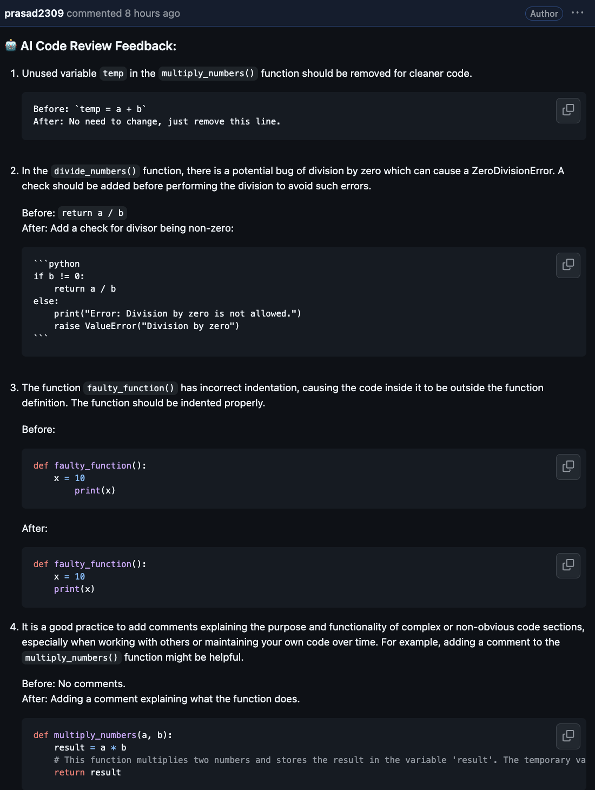

# 🚀 AI-Powered Code Review Assistant

## 📌 Project Overview

The **AI Code Review Assistant** automates **GitHub PR code analysis** using **FastAPI**, **Mistral (via Ollama)**, and **GitHub Actions**.  
It fetches PR diffs, runs them through an **AI model (Mistral)**, and posts **AI-generated feedback** as PR comments.

### ✨ **Key Features**
✅ **Automated PR code reviews** using LLMs  
✅ **AI-generated feedback** on code quality, bugs & best practices  
✅ **GitHub Actions integration** for real-time automation  
✅ **FastAPI-based backend** for easy scalability  
✅ **Works with any GitHub repository** with minimal setup  

---

## 🛠 **Tech Stack**
| Component      | Technology Used |
|---------------|----------------|
| **Backend**   | FastAPI (Python) |
| **AI Model**  | Mistral 7B (via Ollama) |
| **Automation**| GitHub Actions |
| **Webhooks**  | GitHub API |
| **Deployment (Optional)** | Ngrok / Render / Railway |

---

## 🚀 **How It Works**
1️⃣ A **Pull Request (PR) is created/updated** in GitHub.  
2️⃣ **GitHub Actions triggers the FastAPI backend**.  
3️⃣ **FastAPI fetches the PR diff** using **GitHub API**.  
4️⃣ The **PR code is analyzed by Mistral (via Ollama)**.  
5️⃣ AI-generated **feedback is posted as a comment** in the PR.  
6️⃣ Developers receive **real-time AI-driven code suggestions!**  

## 🚀 **Sample Output**

